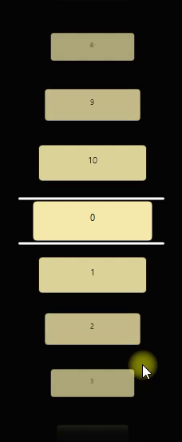

# Carousel

A Vertical animated carousel based on QGraphicsScene. You can Interact with  the scene elements by mouse wheel or mouse click, and keyboard `up` and `down` arrows are also supported. Scene supports any elements inherited from `QGraphicsObject`, see method: `void add(QGraphicsObject* item);`. The scene elements can be of different types, but of the same size, for set item size use `void Carousel::setItemSize(const QSizeF& itemSize);`.



Example

```c++
#include "carousel/carousel.h"

int main(int argc, char* argv[])
{
    QApplication a(argc, argv);
    QGraphicsView v;
    Carousel c;
    c.setBackground(Qt::darkCyan);
    for (int i = 0; i < 1000; i++) {
        c.add(new QGraphicsTextItem(QString::number(i)));
    }
    v.setScene(&c);
    c.setSceneRectangle(v.rect());
    v.show();
    return QApplication::exec();
}

```
